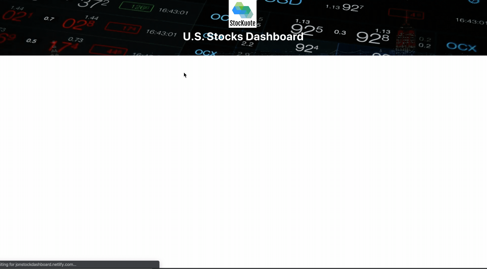
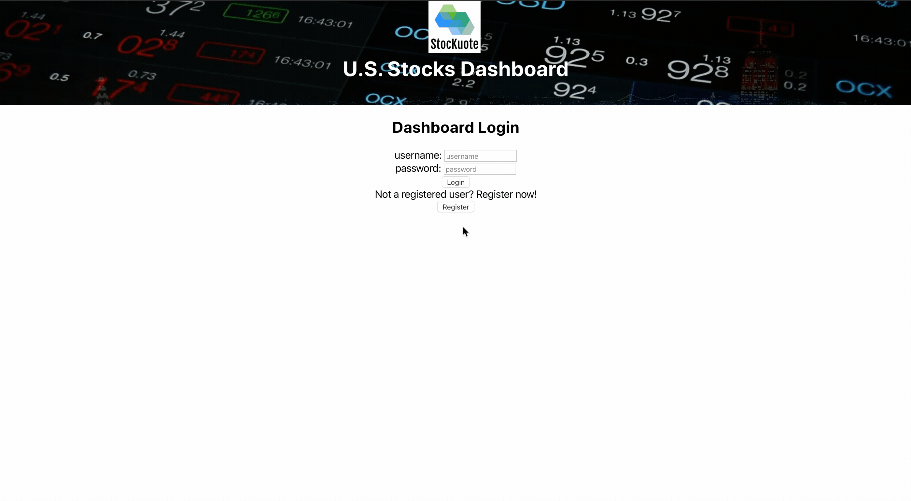

# Stockuote - A stock dashboard app

## Table of Contents

- [Introduction](#Introduction)
- [Technologies](#Technologies)
- [Setup](#Setup)
- [Environment Variables](#Environment-Variables)
- [Availble Scripts](#Available-Scripts)
- [Features Demo](#Features-Demo)

## Introduction

An app that allows users to search for U.S listed stocks and find detailed information (including price charts, stock information, and latest news) about the selected stock. Link to backend: https://github.com/Jonwyp/stock-dashboard-backend

## Technologies

- JavaScript ES6
- React.js 16.12.0
- axios 0.19.2
- rc-slider: 9.1.0
- react-google-charts: 3.0.15
- react-router-dom: 5.1.2

## Setup

To run this project, git clone and install it locally using npm:

```bash
$ cd ../
$ git clone https://github.com/Jonwyp/stock-dashboard-react.git
$ npm install
$ npm start
```

## Environment Variables

- REACT_APP_PTOKEN: token for axios call to IEX API

This project was bootstrapped with [Create React App](https://github.com/facebook/create-react-app).

## Available Scripts

In the project directory, you can run:

```js
npm start // runs the app in development mode
npm test // run test runner in interactive watch mode
npm run coverage // run test coverage without watch mode
npm run build // Builds the app for production
npm run cy:run // run cypress test in headless mode
npm run cy:open // run cypress test in electron browser
```

## Features Demo

Working live demo can be accessed at https://jonstockdashboard.netlify.com/

<em>**Login to dashboard:**</em>



<em>**User registration:**</em>



<em>**Searching for stocks:**</em>


<em>**Community forecast for stocks:**</em>


<em>**Charts for stocks:**</em>


<em>**Latest news:**</em>


